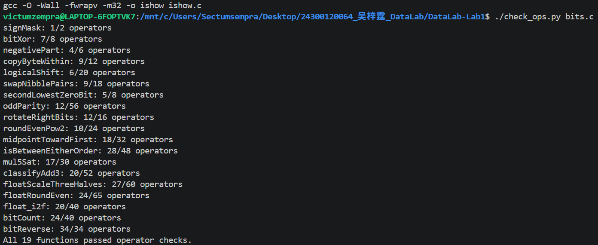
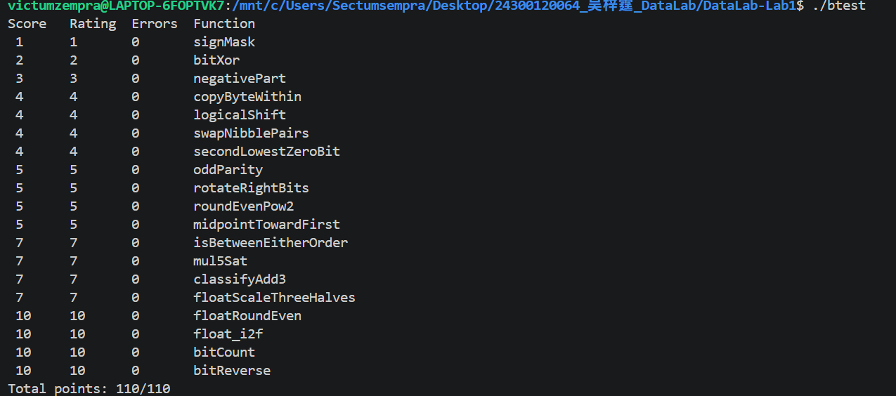

# CS:APP Data Lab 实验报告

**姓名**：吴梓霆  
**学号**：24300120064  
**课程名称**：计算机系统基础  
**实验内容**：Datalab  
**实验日期**：2026 年 10 月 4 日

## 一、实验环境与测试结果

在 Windows 的 Ubuntu WSL 下完成，编译器是 GCC 13.3.0。代码在 [bits.c](bits.c) 中。

编译后运行 `./check_ops.py bits.c`，19 个函数都通过了操作数检查。

再运行 `./btest`，没有报错，得分是 110/110。下面是 10 月 4 日的测试截图。

## 二、实现思路

**P1 signMask**

把 1 左移 31 位，只留下最高位。

**P2 bitXor**

两个位不一样时结果才是 1。用 `~(x & y)` 排除同时为 1，再用 `~(~x & ~y)` 排除同时为 0，最后相与运算。

**P3 negativePart**

用 `x >> 31` 判断符号，再和 `~x + 1` 相与。这样负数取相反数，其他情况返回 0。`INT_MIN` 取负后还是原来的位模式。

**P4 copyByteWithin**

先取出源字节，清空目标位置，再把源字节放过去。要先取出再清空，不然源和目标相同时会有问题。

**P5 logicalShift**

主要是负数右移会补 1，要用掩码清掉。掩码写成 `~(((1 << 31) >> n) << 1)`，这里还得注意 `n=0` 和 `n=31` 两种情况。

**P6 swapNibblePairs**

用掩码分别取出每个字节的高、低 4 位，往相反方向移 4 位再合起来。掩码从小常量拼出来。

**P7 secondLowestZeroBit**

先用 `x | (x + 1)` 把最低的 0 填上，再找新的最低 0，就是原来的第二个。

**P8 oddParity**

反复右移并异或，把奇偶性合到最低位，最后取逻辑非。

**P9 rotateRightBits**

把右移部分和绕回高位的部分拼起来。比较容易漏掉的是旋转 0 位，不能直接用 `32-shift`，不然会移位 32。这里把移位量都用 `& 31` 处理。

**P10 roundEvenPow2**

先加偏置再清掉低位。刚好在中间时要看商是奇数还是偶数，不能一律往上舍入，比如按 4 的倍数舍入，10 要变成 8，14 要变成 16。

**P11 midpointTowardFirst**

直接加起来可能溢出，所以用 `(x & y) + ((x ^ y) >> 1)`得到一个不会因直接计算 `x+y` 而溢出的基础中点；当和为奇数时，再根据 `x` 与 `y` 的大小关系修正 1。

**P12 isBetweenEitherOrder**

分别比较 `x<a` 和 `x<b`，再补上等于端点的情况。异号时看符号，同号时才看差值，不然减法溢出会影响判断。

**P13 mul5Sat**

不能只看最终乘积的符号，溢出后符号有可能又变回来。所以分成乘 2、乘 4、乘 5，每一步都检查。溢出就按原数的正负返回最大值或最小值。

**P14 classifyAdd3**

这题比较绕，前两项溢出后，第三项还可能把它抵消。把每个数拆成 `4q+r`，分别加商和余数，再判断合并后的商是否超出 30 位有符号数的范围，这样可以不用直接算可能溢出的三项和。

**P15 floatScaleThreeHalves**

先拆开符号、阶码和有效数，让有效数乘 3 后再移位。规格化数和非规格化数的隐藏位不同，这里要分开处理。舍入也不能直接截断：超过一半就进位，刚好一半则让保留的部分变成偶数。

**P16 floatRoundEven**

根据阶码找到小数位，清掉后再决定要不要进位。中点最容易搞混，比如 1.5 变成 2，2.5 也变成 2。另外，负数舍入到零时要保留负号。

**P17 float_i2f**

用 `unsigned` 保存绝对值，避免 `INT_MIN` 的问题。把最高的 1 移到第 31 位，保留高 24 位，用低 8 位判断舍入。舍入可能让有效数再进一位，阶码也要跟着变。

**P18 bitCount**

不能循环数，就分组相加，先数每 2 位，再合并成 4 位、8 位，最后加到一起。答案最多是 32，最后保留低 6 位就够了。

**P19 bitReverse**

逐步交换相邻的 1、2、4、8、16 位组。思路能理解，但操作数只有 34 次，mask不能都单独构造，要利用前一个得到下一个。最后左移 16 位时省掉一次与运算，刚好卡在上限。

## 三、感想和建议

感觉这个 lab 还是太难了，尤其是后面的浮点数和操作数限制。知道大概应该怎么做，和真正的coding差别还是挺大的。浮点舍入还有不少特殊情况，几个规则放在一起容易弄混。

希望后面的题能适当降低一点难度，或者多给一点思路提示。特别是浮点数的题，如果能给几个中间过程的例子，会更容易理解一些。

## 四、参考资料与辅助说明

- [本学期实验文档](https://ics-26fall-fdu.github.io/labs/lab1-data-lab/)与[官方模板仓库](https://github.com/ICS-26Fall-FDU/DataLab)，用于核对今年的题意、编码限制和测试方法。
- 在独立思考和完成实验的基础上，使用 ChatGPT 辅助梳理报告表述，并用于理解少数题目涉及的位运算和浮点数知识；测试结果均来自实际运行。

