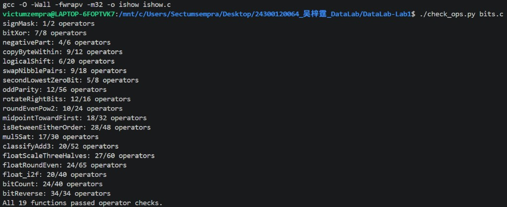
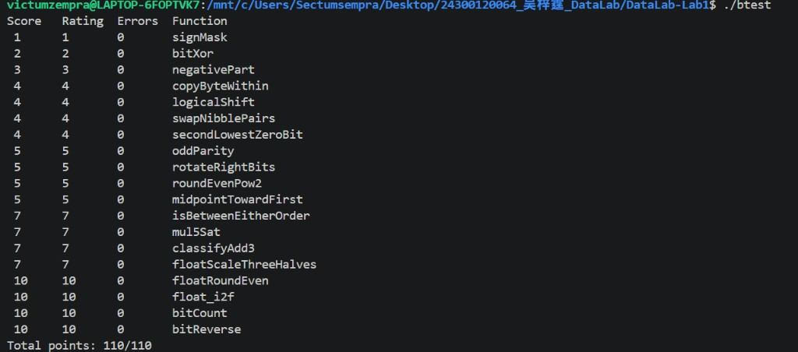

# Data Lab 实验报告

姓名：吴梓霆  
学号：24300120064  
GitHub：DunkelByte  
实验日期：2026 年 10 月 3 日

## 实验目标与环境

根据[课程实验说明](https://ics-26fall-fdu.github.io/labs/lab1-data-lab/)和[今年模板仓库](https://github.com/ICS-26Fall-FDU/DataLab)，完成 `bits.c` 的 P1–P19。整数题按模板规定的 32 位补码位向量模型理解：算术右移补符号位，加法及左移保留低 32 位，移位量必须为 0–31。浮点题仅使用整数运算处理单精度编码。

验证环境为 Windows 上的 WSL、Ubuntu 24.04、GCC 13.3.0；使用模板的 `-O -Wall -fwrapv -m32` 编译参数。代码修改限定在 `bits.c` 的函数体内，保留测试程序、函数签名及 `.github` 评分配置。

## 实现思路

以下括号中的数字为规则检查器给出的“实际操作数／允许上限”。完整实现见 [bits.c](bits.c)。

### P1：signMask（1／2）

将常量 `1` 左移 31 位，得到只含最高位的掩码 `0x80000000`。

### P2：bitXor（7／8）

逐位异或要求两个输入位不同。用 `~(x & y)` 排除同时为 1，用 `~(~x & ~y)` 排除同时为 0，取二者交集；只使用题目允许的 `~`、`&`。

### P3：negativePart（4／6）

`x >> 31` 产生全 0 或全 1 掩码，与补码取负 `~x + 1` 相与即可。对 `INT_MIN`，数学上的相反数不可表示；按照本实验的低 32 位规则，结果仍为 `0x80000000`，不能将该情况误认为普通正数绝对值。

### P4：copyByteWithin（9／12）

先右移并与 `255` 取得源字节，再清空目标字节，最后将源字节移入目标位置。提取发生在原始 `x` 上，因此 `src == dst` 时也保持原值。

### P5：logicalShift（6／20）

先执行算术右移，再用 `~(((1 << 31) >> n) << 1)` 清除高位的符号扩展。该掩码在 `n == 0` 时为全 1，在 `n == 31` 时仅最低位为 1。

### P6：swapNibblePairs（9／18）

由小常量构造 `0x0f0f0f0f`，分别选取每个字节的低半字节和右移后的高半字节，再向相反方向移动 4 位并合并。

### P7：secondLowestZeroBit（5／8）

`x | (x + 1)` 将最低的 0 位填成 1；随后 `~filled & (filled + 1)` 定位新状态下最低的 0 位。若原输入不足两个 0 位，结果自然为 0。

### P8：oddParity（12／56）

按 16、8、4、2、1 位依次右移并异或，把所有位的异或值折叠到最低位。最低位为 0 表示原输入的 1 位数量为偶数，取逻辑非得到所需奇校验位。

### P9：rotateRightBits（12／16）

先用 `n & 31` 对旋转位数取模，再合并逻辑右移部分和绕回高位的左移部分。左移量为 `(-shift) & 31`，代码用补码构造负数；旋转 0 位或 32 的倍数时不出现移位 32 的情况。

### P10：roundEvenPow2（10／24）

给 `x` 加上 `2^(n-1)-1+((x>>n)&1)` 后清除低 `n` 位。余数恰为一半时，只有原商为奇数才进位，因而选择偶数商。题目给定的 `x` 上界保证添加偏置不会溢出。

### P11：midpointTowardFirst（18／32）

利用 `(x & y) + ((x ^ y) >> 1)` 直接得到向下取整的中点，避免先算 `x+y`。仅在和为奇数且 `x>y` 时加 1。比较时，异号输入看符号，同号输入看差值符号，避免差值溢出影响判断。

### P12：isBetweenEitherOrder（28／48）

分别安全判断 `x<a` 和 `x<b`。两个严格比较结果不同时，`x` 位于端点之间；再显式纳入与任一端点相等的情况，覆盖闭区间和 `a==b`。端点顺序无需预先确定。

### P13：mul5Sat（17／30）

依次计算 `2x`、`4x`、`5x`，检查每一步的符号变化。前两步已经溢出时，最终乘 5 必然越界；前两步未溢出时，最后一步符号变化就是乘 5 溢出。原输入符号决定选取 `INT_MIN` 或 `INT_MAX`。

### P14：classifyAdd3（20／52）

将每个输入分解为 `x=4q+r`，其中 `q=x>>2`，`r=x&3`。分别相加并合并余数进位，得到 `high=floor((x+y+z)/4)`。其范围为 `[-1610612736,1610612735]`，所有中间加法均可表示。原精确和能用 32 位表示，当且仅当 `high` 能用 30 位有符号数表示，即 `high>>29` 等于 `high>>31`；否则根据符号返回 1 或 -1。这也处理了先溢出、再被第三个数抵消的情况。

### P15：floatScaleThreeHalves（27／60）

拆出符号、阶码与有效数；规格化数补上隐藏位，非规格化数不补。有效数乘 3 后，根据是否需要规格化右移 1 或 2 位，保留被丢弃的余数，按“超过一半进位、恰好一半取偶数”舍入。组合编码时保留进位，从而处理非规格化数跨入规格化范围。最小正非规格化数乘 1.5 后处于两编码中点，结果取偶数编码 `0x00000002`。NaN 原样返回，保留正负零，溢出得到对应符号的无穷大。

### P16：floatRoundEven（24／65）

按阶码分类：绝对值小于 0.5 时返回同符号零；恰为 0.5 也取零，介于 0.5 和 1 之间取同符号 1。其余非整数清除小数位，再按余数与半程及整数奇偶性决定进位。阶码足够大时原值已是整数；NaN 和无穷大也在直接返回的分支中。

### P17：float_i2f（20／40）

在 `unsigned` 中求幅值，避免 `INT_MIN` 的绝对值问题。不断左移，直至最高有效位位于第 31 位，同时调整阶码；保留高 24 位，以低 8 位判断最近偶数舍入。打包时用加法，使有效数舍入产生的进位自然进入阶码。

### P18：bitCount（24／40）

构造分组掩码，并由较宽掩码与其移位结果异或得到较窄掩码。先分别累计 2 位、4 位、8 位组内的 1 位数量，再合并字节及半字，最后保留低 6 位，足以表示 0–32。

### P19：bitReverse（34／34）

逐级交换相邻的 1、2、4、8、16 位组。每一步在右移后用掩码消除符号扩展，最后交换两个半字。复用相邻宽度掩码之间的关系，将操作数控制在 34 次上限内。

## 验证结果

在上述 WSL 环境中重新构建并运行 `./test.sh`，构建、规则检查及正确性测试均通过，`btest` 的 19 题错误数均为 0，总分为 **110／110**。规则检查使用今年的 `./check_ops.py bits.c`，由它调用 `dlc` 检查各题；不直接用旧 `dlc` 识别全部新函数名。

复现命令：

```bash
./test.sh
```

也可分别执行 `make clean`、`make all`、`./check_ops.py bits.c` 和 `./btest`。以下为实际执行相应命令后取得的 **WSL 命令控制台截图**，同时保留原始文本输出，便于核对。



[规则检查原始日志](assets/check_ops.txt)



[正确性测试原始日志](assets/btest.txt)

边界核查重点包括 `INT_MIN`／`INT_MAX`、同号与异号输入、0 和 31 位移位、旋转 32 的倍数、恰好一半的舍入、饱和阈值、正负零、非规格化数、无穷大及 NaN。上述结果是已执行测试的结论，不作为对所有输入的形式化验证声明。

## 资料与辅助说明

题意、限制及评分行为以[今年官方模板](https://github.com/ICS-26Fall-FDU/DataLab)中的 `README.md`、`bits.c`、`tests.c` 和检查脚本为准；流程要求参照[课程实验页面](https://ics-26fall-fdu.github.io/labs/lab1-data-lab/)。

另参考了用户提供的往年 `DataLab.zip`，其中包含范庭朔的实验报告，用途为报告结构与解题思路对照。今年题目逐项依据当前模板重新核对。

本次实现、边界分析、测试组织和报告整理使用了 OpenAI Codex 辅助。报告中的算法说明对应最终代码，测试结果来自实际执行记录。
